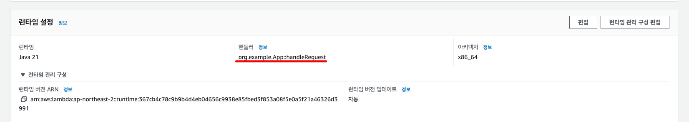

# daily-commit-notifier

오늘 커밋을 했는지 여부를 밤마다 알림을 주는 AWS Lambda 함수

- AWS Lambda + EventBridge + Telegram Bot API

### deploy

- `build.gradle`에 `shadowJar` 플러그인을 추가해야 함
- `build/libs` 디렉토리에 `app-all.jar` 파일이 생성되어 있어야 함
 
```bash
./gradlew shadowJar

aws lambda update-function-code \
    --function-name daily-commit-notifier \
    --zip-file fileb://./app/build/libs/app-all.jar
```

### AWS Lambda 관련 설정

AWS Lambda 사용 시 런타임 설정의 핸들러 명칭을 정확히 잘 적어주어야 동작한다.



### ToDo

- [x] kotlin lambda function 배포 (hello만 리턴)
- [x] aws eventbridge 크론 작업 연결
    - [x] 인프라 생성
    - [x] 로그 남기기
- [x] 배포 aws cli로 해보기
    - [x] aws access key 발급
    - [x] aws lambda update-function-code로 배포
- [x] 텔레그램 메신저 연동
    - [x] 텔레그램 API 연결
    - [x] 특정 ID (내 ID) 에게 메시지 보내기
- [x] github api 연결 및 테스트 코드 작성
  - [x] github api 호출 전용 토큰 발급
  - [x] 외부 api 호출 클라이언트 라이브러리 선정 및 설치
  - [x] github api 호출 후 결과 string 만들기
  - [x] 텔레그램에 커밋 숫자 전달
- [x] 커밋 숫자 정확하게 가져오도록 변경 
  - commit을 한번에 푸쉬하면, PushEvent 타입으로 한번만 인식되고 그 안에 여러 커밋이 존재. 
  - PushEvent 이벤트 안에 있는 커밋의 커밋 수를 가져와야 함? 
    - (하지만... 각각 커밋의 날짜는 들어있지 않다.)
    - 21일 11시 50분에 커밋을 하고 22일 00시 10분에 푸쉬하면, 21일에 커밋을 한 것으로 인식되어야 함 
- [ ] 텔레그램에 보낼 텍스트 예쁘게 다듬기
- [ ] 커밋으로 인식되는 이벤트 종류 정확하게 파악 필요
- [ ] github actions에서 배포 자동화
